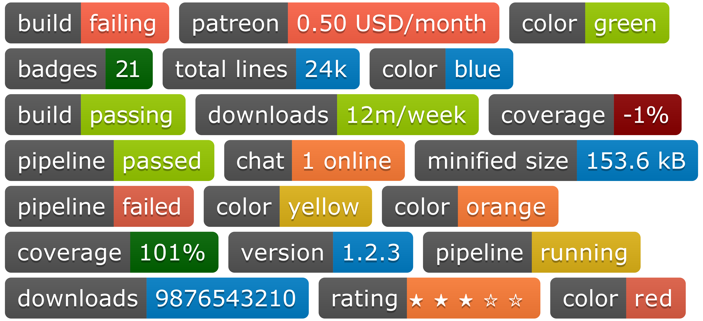

# Badges für private Repositories erstellen



## Einleitung
Oft sieht man in den READMEs populärer Open Source Projekte eine Vielzahl bunter Badges, die einem eine schnelle Übersicht über den Projektstatus geben sollen.
In diesem Artikel wollen wir uns anschauen, wie auch wir eigene Badges erstellen und diese dann in unseren Projekten einbinden können.

Der fertige Code kann [hier](https://github.com/MalteHei/custom-badges) gefunden werden.


## Aussgangssituation
Wir entwickeln eine versionierte Webseite, deren Sourcen auf einem unternehmensinternen Server liegt (z.B. GitLab). Die Abhängigkeiten unserer Webseite managen wir mit [npm](https://www.npmjs.com/).

### Badges erstellen
Natürlich sind uns keine Grenzen gesetzt, welchen Inhalt unsere Badges haben werden. Doch für einen leichten Einstieg demonstriere ich nun, wie wir eine Badge erstellen können, welche die aktuelle Version unseres Projekts beinhaltet.

#### Version anhand der package.json herausfinden
Wenn wir die Version unserer Webseite in der `package.json` pflegen, ist es ein Leichtes, diese programmatisch zu extrahieren:
```js
// scripts/badges.js

const version = require('../package.json').version;
console.log(version);
```
Führen wir dieses Skript via `node scripts/badges.js` aus, wird das Attribut `version` aus der `package.json` geladen und schließlich in der Konsole ausgegeben.

#### Skript erweitern
Um eine Badge zu erstellen, wird das Paket `badge-maker` benötigt:
```bash
npm install --save-dev badge-maker
```

Zunächst müssen wir die benötigten Abhängigkeiten laden:
```js
const { makeBadge } = require('badge-maker');
const fs = require('fs');
```
>`fs` ist ein in node.js integriertes Modul, welches Interaktionen mit dem Dateisystem ermöglicht.
>Dies wird spätestestens benötigt, sobald wir die Badge in einer Datei speichern wollen.

Nun können wir aus der extrahierten Version eine Badge erstellen:
```js
const version = require('../package.json').version;
const svgVersion = makeBadge({
  label: 'Version',
  message: version,
  color: 'blue',
});
```
Die Funktion `makeBadge()` liefert einen String, der das gewünschte `<svg>`-Element enthält.
Dafür muss ein Objekt übergeben werden, welches das Format der resultierenden Badge beschreibt (siehe https://www.npmjs.com/package/badge-maker#format).

Gespeichert werden sollen unsere Badges im Verzeichnis `badges/`, welches zunächst erstellt werden muss:
```js
fs.mkdir('badges', err => {
  if (err && err.errno !== -17) console.error(err);
});
```
Die Funktion `fs.mkdir()` erwartet eine Callback-Funktion, der bei einem Fehler eben dieser übergeben wird.
Da diese Funktion jedoch bei _jedem_ Aufruf ausgeführt wird, sollte man überprüfen, ob es überhaupt einen Fehler gibt.
Außerdem wollen wir keinen Fehler ausgeben, wenn das Verzeichnis bereits existiert (der Fehlercode dafür ist `-17`).

Zu guter Letzt speichern wir die Badge in `badges/version.svg`:
```js
fs.writeFile('badges/version.svg', svgVersion, err => {
  if (err) console.error(err);
});
```
Vereinen wir nun diese Codeschnipsel in einem Skript und führen dieses via `node scripts/badges.js` aus, finden wir anschließend ein neues Verzeichnis, `badges/`, welches die Datei `version.svg` beinhaltet.

#### Badge in README einbinden
Schließlich müssen wir die jüngst erstelle Badge nur noch in der README einbinden:
```md
<!-- README.md -->
# Mein Projekt [](https://githost.my-company.com/path/to/project "Mein Projekt")
```
#### NPM Skripte erstellen
Damit die Badges automatisch aktualisiert werden, können wir der `package.json` folgende Skripte hinzufügen:
```json
{
  "scripts": {
    "postinstall": "npm run badges:make",
    "badges:make": "node scripts/badges.js"
  }
}
```
>Alternativ könnte man auch die CI-Pipeline um einen Job erweitern, der die Badges immer dann generiert, wenn Änderungen an der `package.json` vorgenommen wurden.

### Noch mehr Badges!
#### Anzahl veralteter Abhängigkeiten
```bash
npm i -D npm-check
```
```js
const { makeBadge } = require('badge-maker');
const fs = require('fs');
const npmCheck = require('npm-check');

npmCheck().then(state => {
  const numOutdated = state.get('packages').filter(pkg => !!pkg.bump).length;
  const svgOutdated = makeBadge({label: 'Outdated', message: ''+numOutdated, color: (numOutdated === 0 ? 'green' : 'red')});
  fs.writeFile('badges/outdated.svg', svgOutdated, err => {
    if (err) console.error(err);
  });
});
```

#### noch mehr Badges ??

## Fazit ??
